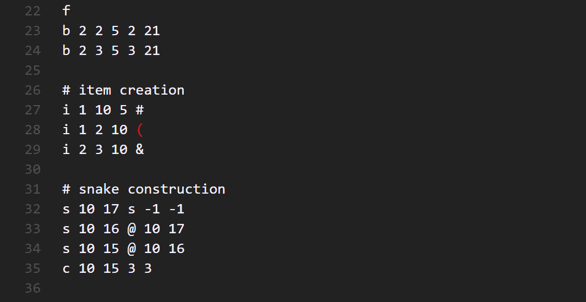

# MySnakeGame

> **23夏程序设计实践大作业**
> 成员:
> *7/13 截止*

## 实现思路:

- 游戏地图以block为单元, 蛇和物品等通过指针指向block来标记其位置
- 渲染游戏界面时也以block为单位进行

## 实现的功能

### 界面:

- 游戏要素的色彩
- 艺术字logo
- 更好的游戏菜单
- 帮助界面和中途退出界面

### 模式:

- **经典模式(Classic):**
  - 循环往复的游戏地图
  - 食物(黄色``#``), 分数
  - 逐渐增加的游戏难度(速度)
  - 随分数增加添加爱心(红色``+``), 可增加生命值

- **文字蛇模式(WordSnake):**
  - 蛇初始为两个``@``字符组成
  - 地图上随机生成26个字母, 被吃掉后加入蛇尾
  - 从蛇尾开始向头部看, 如果产生完整单词, 这部分蛇身将与蛇分离, 并向相反方向运动
  - 由于地图循环往复, 这些掉落的单词也会一直运动下去, 游戏难度便随着拼出一个个单词而增加
  - 拼成单词时加分, 分数与单词长度相关
  - 使用CET4词库中长度不小于3的单词

- **沙盒模式(SnakBox):**
  - 根目录下的``/data/maps/sand_box.map``为沙盒模式使用的地图文件
  - 用文本编辑器修改该文件来达到自定义游戏地图的目的

> ### 沙盒模式地图文件语法
>
> #### 地图部分
> 
> 第一行必须是``m <int 1> <int 1>``的格式, 其中两个非负整数分别代表地图的高度和宽度, 以下称作``height``和``width``
> 紧随其后的``height``行描述地图每一排的方块类型和渲染用字符
> - 数字代表方块类型, 紧随其后的字符表示渲染出来的样子
>   - ``0``: 空方块
>   - ``1``: 墙, 不可穿越, 蛇撞上即死亡
>   - ``2``: 传送门, 蛇和实体(``Entity``)都可以穿过 
>   - ``3``: 障碍, 蛇消耗生命值可以穿过, 实体不能穿过
>
> *由于传送门的创建还需要指明传送位置, 因此必须在接下来的命令部分完成, 遇到``2``时程序会用空方块占位*
>
> 地图样例:
> 
> 
>
> #### 命令部分
>
> 紧接着地图部分的下一行以``f``开头即声明以下将为命令
> 命令的第一个字符代表其类型, 跟着的是参数
>
> - ``b``: 创建方块的命令, 推荐用来创建传送门.
>   - ``b <int 0> <int 1> <int 2>`` 第一个整数代表方块类型, 之后的两个代表方块坐标, 传送门需要额外两个整数来作为传送目标的坐标
> - ``i``: 创建物品
>   - ``i <int 0> <int 1> <int 2> <char>`` 第一个整数代表物品类型, 其中``1``代表食物, ``2``代表心, ``3``代表物品位的蛇身(SnakeBody), 后者需要多两个整数来说明下一节蛇身的位置, 如果提供两个负值则认为没有下一节; 之后的两个整数代表创建位置, 字符作渲染用
> - ``s``: 声明蛇身
>   - ``s <int 1> <int 2> <char> <int 3> <int 4>`` 前两个整数代表蛇身生成的位置, 字符作渲染用, 后面的两个整数代表下一节蛇身的位置, 提供两个负值则认为没有下一节
> - ``c``: 声明蛇, 需要基于已经创建且连接好的蛇身
>   - ``s <int 1> <int 2> <int 3> <int 4>`` 前两个整数代表蛇头的位置, 第三个代表初始生命值, 第四个代表初始方向(从向上开始, 逆时针依次为``0 1 2 3``)
> - ``e``: 声明实体, 需要基于已经创建且连接好的蛇身
>   - ``e <int 1> <int 2> <int 3> <int 4>`` 前两个整数是"蛇头"位置, 第三个代表初始方向, 第四个代表初始长度(当然需要与你准备好的蛇身链表长度相同)
>
> *虽然这些命令提供了足够的自由度, 以至于你可以将传送门的出口设置在
其自身上, 也可以将物品位的蛇身和普通蛇身串起来提供给蛇和实体等等, 但这些行为对游戏的稳定运行并不友好*
> 
> 命令样例:
> 
> 
> 

## 源代码实现说明

